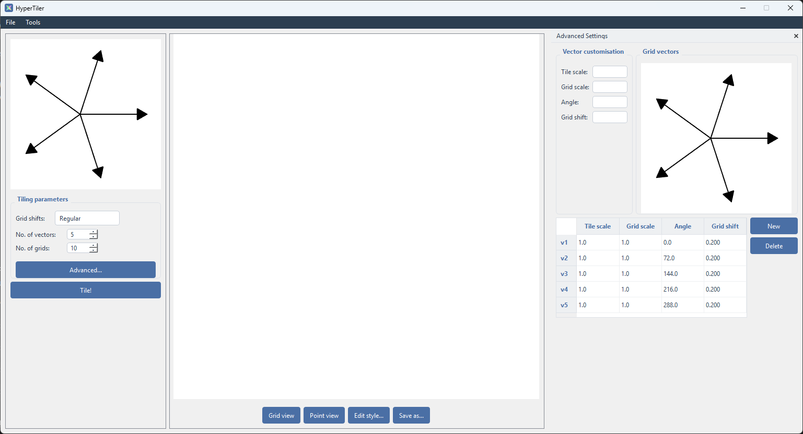

# ☆ HyperTiler

HyperTiler makes creating patches of quasiperiodic tilings easy!

## 🌟 Highlights

- Create ANY dual-grid tiling defined by custom parameters.
- Generate tilings using established substitution rules, or make your own!
- Save tilings, tiling properties, and perform some basic spatial analysis.


## ℹ️ Overview

My goal for HyperTiler was to create a friendly low/no-code tool that allows anyone to generate quasiperiodic tilings. It's aimed at tiling enthusiasts both inside and outside of academia: you can just use it to create nice patterns, or to create input files for theoretical simulation.

You can make tilings one of two ways: the dual-grid method, or by substitution rules. Both have an endless amount of flexibility, based on the input parameters. 


## 🚀 Usage

**Recommended:** read through the user guide pdf for a more detailed explanation (soon to be a wiki) -- this is just a lightweight overview!

### Dual-grid mode



### Substitution mode

### Analysis


## ⬇️ Installation

Requires Python 3.11+.

```bash
pip install hypertiler
```

Then launch it from anywhere with:

```bash
hypertiler
```


### ✍️ Authors

Sam Coates - [University of Liverpool](https://www.liverpool.ac.uk/people/samuel-coates)

## 💭 Feedback and Contributing

Have an idea for a contribution? Want to point out any bugs? 

[Start a discussion!](https://github.com/hyper-aperiodic/HyperTiler/discussions)

Or just [email!](mailto:Samuel.Coates@liverpool.ac.uk)

## ✍🏻 Acknowledgements 

Work funded by EPSRC Grant No. EP/X011984/1.

I started development of this code under the above grant, back in 2023. So the conceptualisation, application of mathematical methodology, design desisions, and initial back-breaking development of the codebase is all human-driven. 

Claude Code was used to refactor, spell-check, organise, and polish off the UI.