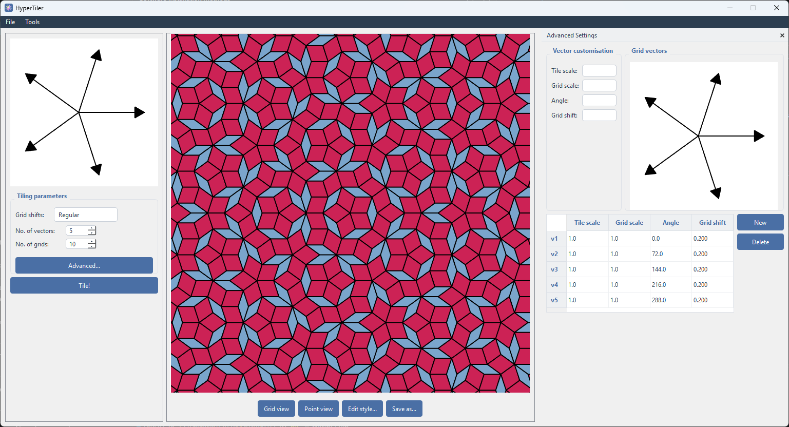
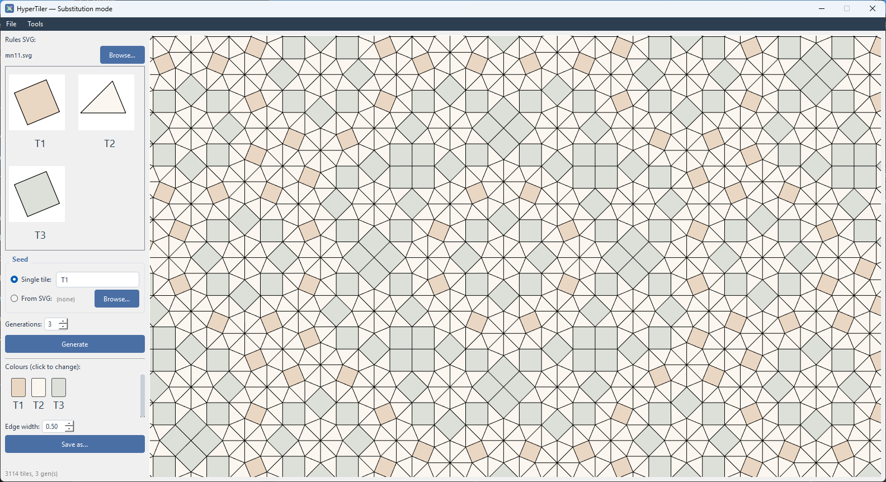
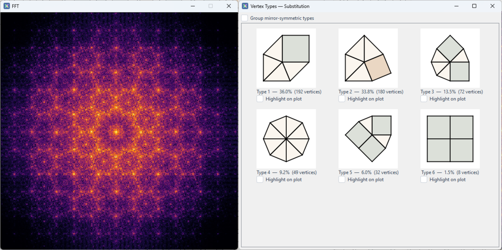
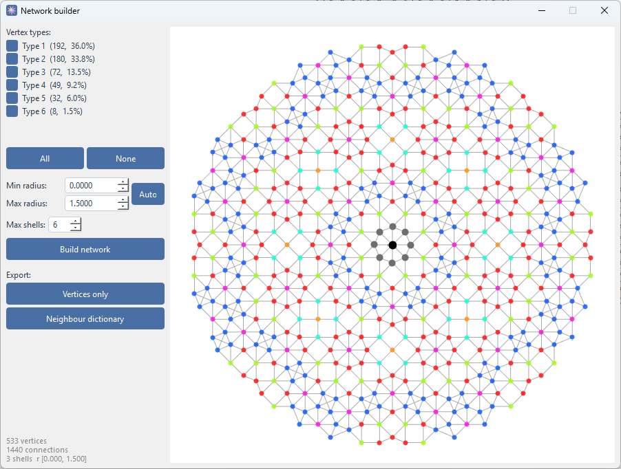

# ☆ HyperTiler

HyperTiler makes creating patches of quasiperiodic tilings easy!

[](https://github.com/hyper-aperiodic/HyperTiler/releases/latest)

[](https://hypertiler.readthedocs.io/en/latest/?badge=latest)

[](https://doi.org/10.5281/zenodo.22133798)

## 🌟 Highlights

- Create ANY dual-grid tiling defined by custom parameters.
- Generate tilings using established substitution rules, or make your own!
- Save tilings, tiling properties, and perform some basic spatial analysis.


## ℹ️ Overview

My goal for HyperTiler was to create a friendly low/no-code tool that allows anyone to generate quasiperiodic tilings. It's aimed at tiling enthusiasts both inside and outside of academia: you can just use it to create nice patterns, or to create input files for theoretical simulation.

You can make tilings one of two ways: the dual-grid method, or by substitution rules. Both have an endless amount of flexibility, based on the input parameters. 


## 🚀 Usage

**Recommended:** Read the docs: [](https://hypertiler.readthedocs.io/en/latest/?badge=latest)

### Dual-grid mode

Dual-grid mode builds tilings using de Bruijn's method from two sets of vectors: **tiling** and **grid**. In default mode, you shape the tiling by adjusting the number of vectors, the number of grids (which sets the size of the tiling patch), and the grid shifts.

Advanced mode drops those defaults and lets you customise every vector individually - a far more powerful way to design fully custom tilings.



### Substitution mode

Substitution mode builds tilings with substitution rules that are supplied in the form of a structured svg file. Tilings can be initiated with a single tile, or a seed svg file with an initial design.

The *example svgs* folder contains some sample files, otherwise, see the HyperTiler guide on how to create your own svgs.



### Analysis

HyperTiler comes with a couple of tools for the analysis of the generated tiling - independent of which mode created it.

It can numerically compute the fast Fourier transform of the tiling's point set, and identify every distinct vertex type (or star) present. For anyone wanting to simulate models *on* a tiling, a network builder also produces a connectivity network with nearest-neighbour, next-nearest, and higher-order shell information.
 

 

## ⬇️ Installation

Pick whichever fits how you like to work. Every method below needs Python 3.12+ installed, except the standalone executable.

### No code
1. Download the build for your platform:
   - [Windows](https://github.com/hyper-aperiodic/HyperTiler/releases/latest/download/hypertiler-windows-v1.0.0.zip)
   - [macOS](https://github.com/hyper-aperiodic/HyperTiler/releases/latest/download/hypertiler-macos-v1.0.0.zip)
   - [Linux](https://github.com/hyper-aperiodic/HyperTiler/releases/latest/download/hypertiler-linux-v1.0.0.zip)
2. Unzip and run.

### PyPI package

```bash
pip install hypertiler
```

Then launch it with (from that same environment - activate it first if you used a virtualenv):

```bash
hypertiler
```

### Git clone
```git
git clone https://github.com/hyper-aperiodic/HyperTiler.git
```
Then for Windows, double-click `scripts/setup.bat` once, then `scripts/run.bat` each time after in the same directory. For Mac/Linux:
```bash
bash setup.sh
```
then 
```bash
bash run.sh
```

### Download as a zip

Download the repo as a zip - no git knowledge required. For Windows, double-click `scripts/setup.bat` once, then `scripts/run.bat` each time after in the same directory. For Mac/Linux:
```bash
bash setup.sh
```
then 
```bash
bash run.sh
```

### ✍️ Authors

Sam Coates - [University of Liverpool](https://www.liverpool.ac.uk/people/samuel-coates)

## 💭 Use, Feedback, and Contributing

Used HyperTiler for some academic work? Cite me! [](https://doi.org/10.5281/zenodo.22133798)

Have an idea for a contribution? Want to point out any bugs? 

[Start a discussion!](https://github.com/hyper-aperiodic/HyperTiler/discussions)

Or just [email!](mailto:Samuel.Coates@liverpool.ac.uk)

## ✍🏻 Acknowledgements 

Work funded by EPSRC Grant No. EP/X011984/1.

With thanks to Ellie Weightman for stress-testing!

I started development of this code under the above grant, back in 2023. So the conceptualisation, application of mathematical methodology, design desisions, and initial back-breaking development of the codebase is all human-driven. 

Claude Code was used to refactor, spell-check, organise, and polish off the UI.
