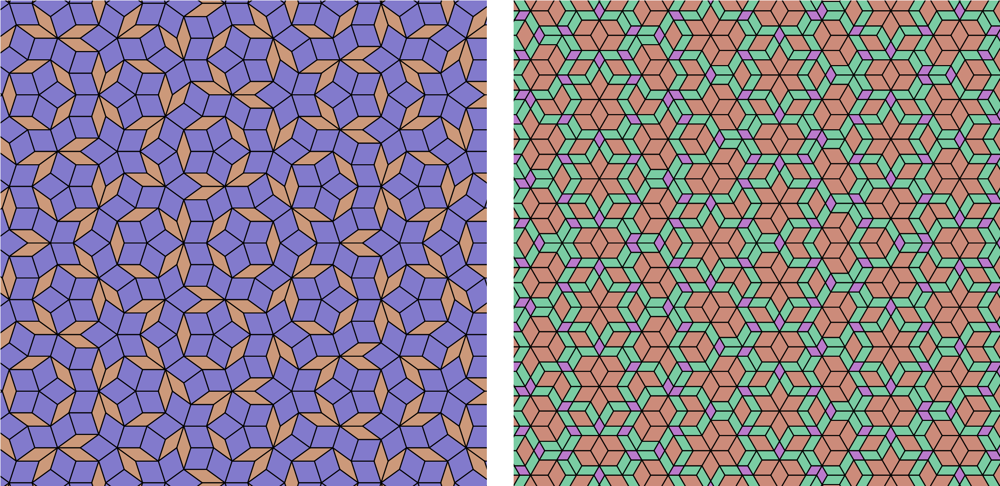

# Quickstart: using HyperTiler as a library

Everything the desktop app does to build a tiling is available as plain
Python. This page shows some of the functionalities, and walks you through creating tilings rather than relying on parsing the [API reference](./api/index.md).

After [installation via PyPI](./installation.md#PyPI-package), we can generate and save a tiling in 6 lines. First, we'll make a dual-grid tiling:  

```python
from hypertiler import regular_vectors, TileMaker, classify_areas, make_colors, write_svg

vector_data = regular_vectors(fold=5, shift="regular")
tm = TileMaker(vector_data, grid_len=6)
poly_type, unique_areas = classify_areas(tm.poly_areas)
palette = make_colors(len(unique_areas))
colors = [palette[t] for t in poly_type]
write_svg("penrose.svg", list(tm.points), colors, edge_color=(0, 0, 0), edge_width=0.02)
```

We'll go through line-by-line to see what's happening here.

## Dual-grid tilings

### Simple setup

`regular_vectors` generates a pair of isotropic vectors for a given symmetry (`fold`). These are the tiling and grid vectors, and `regular_vectors` also gives us a set of grid shifts to produce a *regular* tiling (only two grids intersecting at one point). 

`regular_vectors(fold, shift=...)` accepts the same four modes as the GUI's
"Grid shifts" dropdown:

- `"regular"` (default) - an evenly staggered offset that avoids degenerate
  multi-line crossings. Sensible for most tilings, sums to 1 or .
- `"zero"` - no offset at all - grids are constructed at the origin. Expect polygons!
- `"random"` - offsets drawn independently and uniformly from `(-1, 1)`.
- `"regular_random"` - random offsets, normalised to sum to 1.

### Building the vector set by hand

Using the simple setup is nice, and covers the common cases, but in general `TileMaker` just needs an
`(N, 4)` array - one row per grid vector - if you want full manual control
(matching the GUI's Advanced Settings table):

| Column | Meaning |
|---|---|
| 0 | Tile-space vector length ("Tile scale" in Advanced Settings) |
| 1 | Grid-space vector length ("Grid scale") |
| 2 | Angle, in degrees |
| 3 | Shift - this family's line offset along its own vector |

So we could manually re-make the Penrose-style tiling, or create a set of vectors that make a quasiperiodic hexagonal tiling:

```python
import numpy as np
from hypertiler import TileMaker

penrose_vectors = np.array([
    (1.0, 1.0, 0.0, 0.2),
    (1.0, 1.0, 72.0, 0.2),
    (1.0, 1.0, 144.0, 0.2),
    (1.0, 1.0, 216.0, 0.2),
    (1.0, 1.0, 288.0, 0.2),
])
penrose = TileMaker(penrose_vectors, grid_len=6)

hex_vectors = np.array([
    (1.618, 0.618, 0.0, 0.16),
    (1.0, 1.0, 60.0, 0.16),
    (1.618, 0.618, 120.0, 0.16),
    (1.0, 1.0, 180.0, 0.16),
    (1.618, 0.618, 240.0, 0.16),
    (1.0, 1.0, 300.0, 0.16),
])
hex_tile = TileMaker(hex_vectors, grid_len=6)
```
Which would give us, respectively:



### Making and colouring the tiling
```python
tm = TileMaker(vector_data, grid_len=6)
poly_type, unique_areas = classify_areas(tm.poly_areas)
palette = make_colors(len(unique_areas))
colors = [palette[t] for t in poly_type]
```

`TileMaker` takes the `vector_data` and a `grid_len` argument, which defines the size of the patch of the tiling. Techinically this can go as high as you want, but be warned that viewing tilings will start slowing down on a standard laptop around `grid_len = 50`. `TileMaker` then makes the tiles (!).

`classify_areas` classifies the tiles you give it based on tile area, so that we can colour each tile-type uniquely. Note that we can also pass `tm.ngon_areas` if we know we're creating a tiling with [singular crossings](./theory.md). If you don't know whether you're going to make a singular tiling, and to stay consistent with the rest of our methods, one would write:
```python
all_points = list(tm.p_points) + list(tm.points)
all_areas = list(tm.ngon_areas) + list(tm.poly_areas)
type_idx, unique_areas = classify_areas(all_areas)
```
`make_colors()` creates a unique set of colours for our tile set, with the next line distributing them accordingly. If you don't like the palette generated, just call it again - the starting hue is randomised each time - or pass `scheme="tonal"` with a `base_color` for shades of one colour instead of the full hue circle. You can also skip it entirely and hand-write your own list of `(r, g, b)` tuples, one per entry in `unique_areas`.

Finally:
```python
write_svg("penrose.svg", list(tm.points), colors, edge_color=(0, 0, 0), edge_width=0.02)
```
or
```python
write_png("penrose.png", list(tm.points), colors, edge_color=(0, 0, 0), edge_width=1, size=(1000, 1000), background=(255, 255, 255))
```
will save your tiling as either an `.svg` or a `.png`. 


## Substitution tilings

Substitution (inflation) tilings are driven by a rules SVG you prepare in
Inkscape - see {doc}`user_guide/substitution` for how to author one. Once
you have one, `inkTile` runs the substitution and hands back a flat list of
`(tile_type, coords)` tuples:

```python
from hypertiler import inkTile, write_svg

it = inkTile(gen=4, tile="my_rules")   # reads my_rules.svg
tiles = it.final_tiles                 # [(tile_type, coords), ...]

colors_by_type = {"T1": (30, 60, 120), "T2": (200, 200, 200)}
polys = [coords for _, coords in tiles]
colors = [colors_by_type[t] for t, _ in tiles]
write_svg("substitution.svg", polys, colors)
```

See the {doc}`api/index` for the full parameter list of every function
used here.
