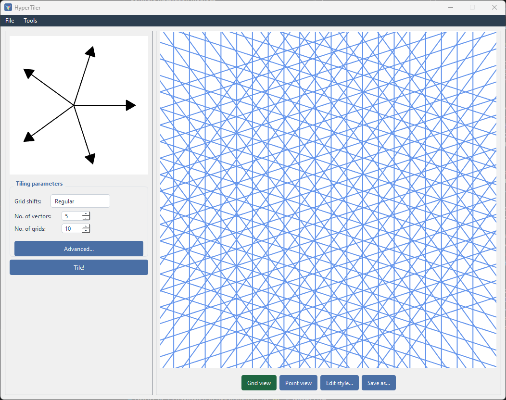
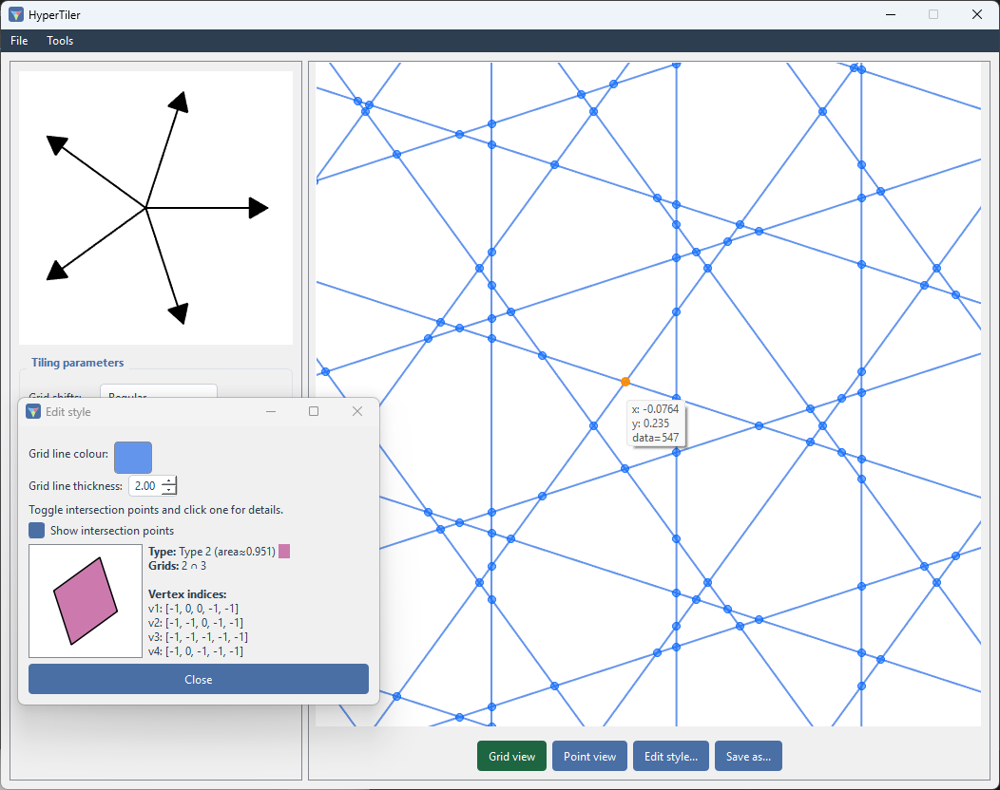

# Theory

Not going to go too deep here, but some context for the mathematics behind
how each method works, and why changing certain parameters produces different tilings.

Both methods produce **quasiperiodic tilings** : no translational symmetry
(you can never slide the tiling onto itself and have it match, the way you
can with a grid of squares), but still strongly ordered rather than random.
That order is what shows up as sharp peaks when you run **Compute FFT** on
a tiling - the same signature scientists look for to identify real
[quasicrystals](https://en.wikipedia.org/wiki/Quasicrystal).

## Dual-grid method

This is de Bruijn's construction [N.G de Bruijn, 1981](doi:10.1016/1385-7258(81)90016-0), the one behind Penrose tilings
among others.

Take `N` families of parallel lines - one family per **grid vector**. Each
family is an infinite set of evenly-spaced parallel lines perpendicular to
its vector, offset from the origin by that vector's **shift** (a fraction
of the line spacing). With `N` vectors arranged symmetrically (e.g. 5
vectors 72° apart), overlaying all `N` families creates a mesh of crossing
lines - the "multigrid":

Lines in a family are separated from their origin governed by their vector. Each step away from the origin is given an integer `N`. This gives each intersection point an `N`-tuple of
integers. The **dual** step maps each *intersection* of the multigrid
(where a line from one family crosses a line from another) to a vertex of
the actual tiling, by computing the dot product of the tile vector and the `N`-tuple. 

Two lines crossing gives an ordinary
rhombus-shaped tile; three or more lines meeting at exactly the same point
(a "singular" crossing) gives a higher-order polygon instead - which is why
the **Grid shifts** setting matters:

- `Zero` shift puts every family through the origin, so *lots* of lines
  cross at exactly the same points.
- `Regular` shift staggers each family just enough that crossings are
  generically simple (only two lines ever meet at a point), which is the
  usual choice for a "clean" tiling of mostly one or two tile shapes.

Whether the result is periodic or quasiperiodic depends purely on the
choice of vector. The symmetry order `N`: for 3, 4, or 6 for isotropic vectors will get you an ordinary periodic
tiling, but [start changing the vectors](./quickstart.md#building-the-vector-set-by-hand) and you can easily make them quasi. Higher order symmetry will always get you quasiperiodicity.

## Substitution method

Also called an *inflation* rule. Instead of starting from an infinite grid,
you start from one or more basic shapes ("supertiles") and a rule for how
each one subdivides into smaller copies of the prototile set, scaled down
by some inflation factor.

Applying the rule once replaces a tile with its subdivision - one
"generation". Applying it repeatedly to a single starting tile produces
patches that grow outward, generation by generation, in the same way a
Penrose tiling can also be built by repeatedly inflating a single rhombus
according to its own substitution rule (the dual-grid and substitution
routes to a Penrose tiling are different constructions of the *same*
underlying structure). In HyperTiler, that rule is whatever subdivision you
draw in the rules SVG (see {doc}`user_guide/substitution`) - the app reads
off the geometry, it doesn't need to know the rule algebraically.
