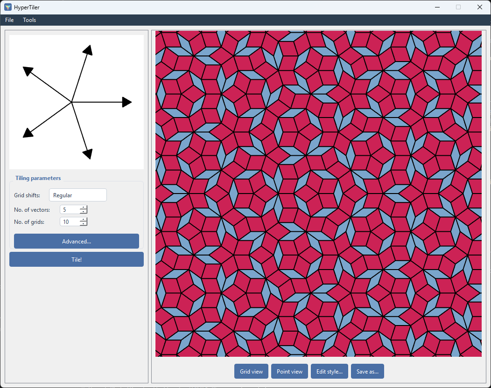
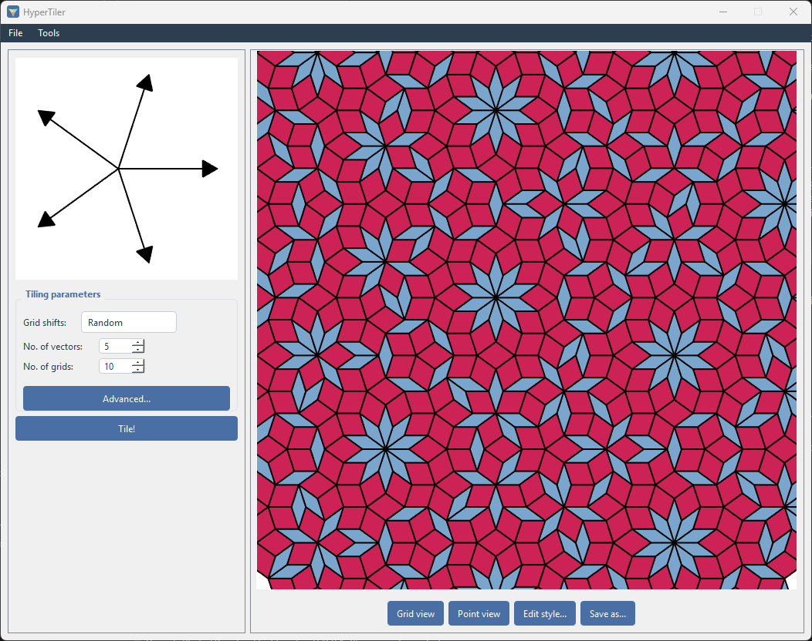
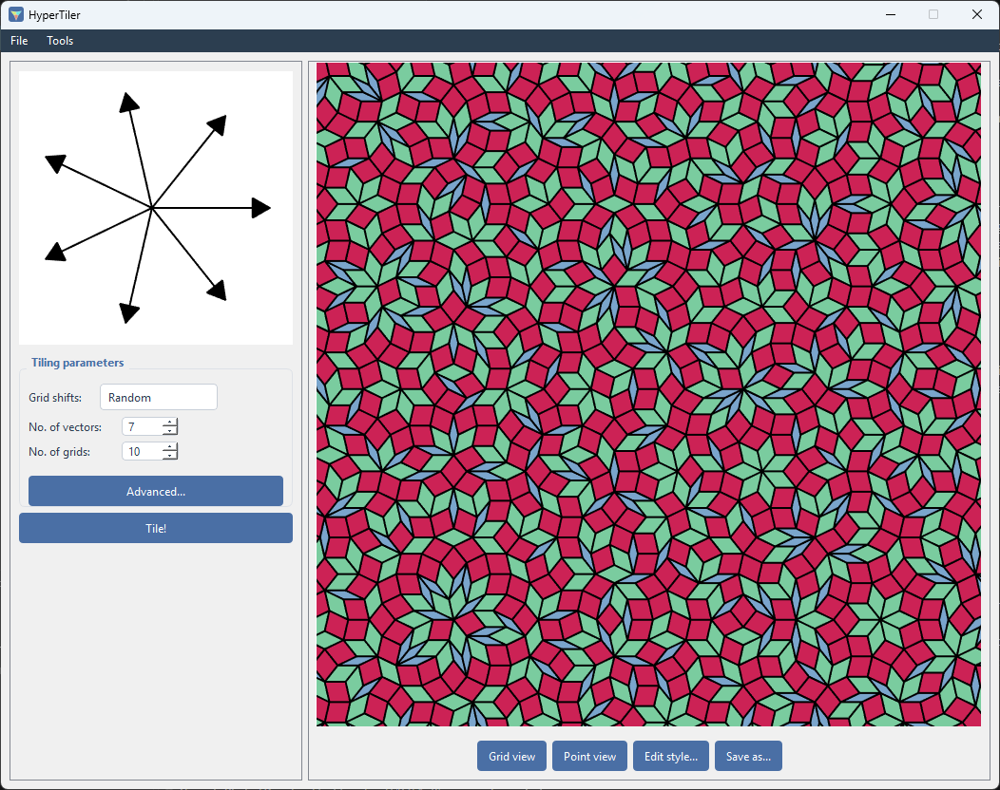
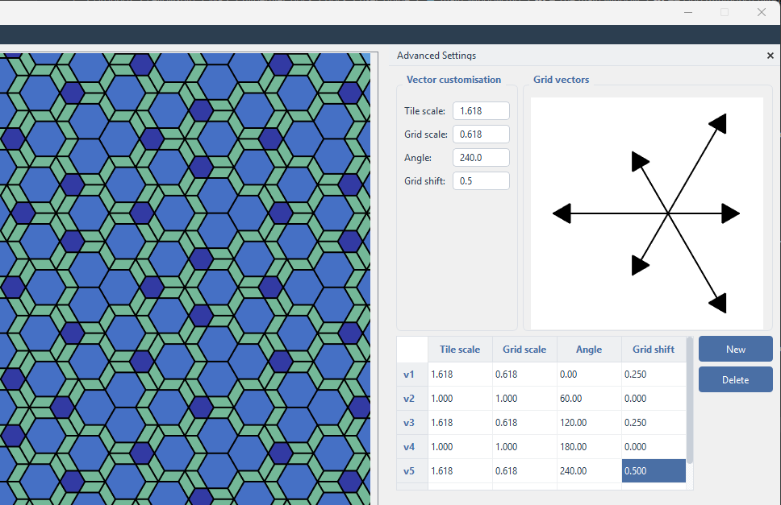

# The main window

HyperTiler generates 2D tilings using two different methods, and lets you
analyse the result the same way regardless of which method produced it.

This guide won't go deep into the mathematics behind these methods - a brief guide can be found [here](../theory.md) - but assumes the reader either is
familiar with them or doesn't care *how* they work and just wants to make
some patterns.

## Layout

The window is split into a parameter panel on the left and a plot on the
right, with a menu bar above both. HyperTiler starts in grid tiling mode, and you can access substitution mode through the tools menu.

### Menu bar

| Menu | Item | Does |
|---|---|---|
| File | Save parameters... <kbd>Ctrl+S</kbd> | Saves the current tiling **recipe** - vectors, grid count,  shift type, colours - not the rendered image. |
| | Load parameters... <kbd>Ctrl+O</kbd> | Reloads a saved recipe, exactly reproducing that tiling setup. |
| | Preferences... | Opens rendering-quality and startup settings ({doc}`preferences`). |
| Tools | Compute FFT | Fourier-transforms the current tiling's vertex points. |
| | Vertex types | Opens the Vertex Types window ({doc}`vertex_types`). |
| | Network builder | Opens the Network Builder window ({doc}`network_builder`). |
| | Substitution tiling... | Switches the whole window into Substitution mode  ({doc}`substitution`). The label changes to "Grid tiling..."  so you can switch back. |

## Grid (multigrid) tilings

You specify a small star of **vectors** - for example five vectors
arranged with 5-fold symmetry, the classic setup behind Penrose tilings.
HyperTiler builds a family of evenly spaced parallel lines for each vector
(a "grid"), finds every intersection between lines from different families,
and turns each intersection into a tile in the resulting tiling. This is the
de Bruijn multigrid / "dual grid" construction. 

Changing the number of
vectors, how each grid is shifted, and how many lines each grid contains
changes the tiling's symmetry, density and character. For example, the above uses `Grid shifts - Regular`, but if we switch to `Grid shifts - Random`, then we get:
 

Or if we add another two vectors:

### Left panel - tiling parameters

- **Vector preview** - a small plot showing the current vector star as
  arrows from the origin.
- **Grid shifts** - how each grid's lines are offset from the origin:
  - `Regular` - an evenly staggered offset that avoids degenerate
    multi-line crossings. The sensible default.
  - `Zero` - no offset - produces a more symmetric tiling with many lines
    crossing at single points.
  - `Random` - offsets drawn randomly.
  - `Regular random` - random offsets, normalised to sum to 1.
- **No. of vectors** - the symmetry order of the grid star (5 for a
  Penrose-style tiling, for example). Changing this rebuilds the vector set
  from scratch.
- **No. of grids** - how many lines each grid family contains, i.e. the
  physical size/density of the tiling. Larger values mean more tiles and
  slower rendering.
- **Advanced...** - opens the Advanced Settings dock, below.
- **Tile!** - builds and draws the tiling from the current settings.

### Advanced Settings

A dockable panel for hand-editing the raw vector data, rather than only the
symmetry-order/shift shortcuts above.

- A form with four spin-box fields for the selected vector: `Tile scale`,
  `Grid scale`, `Angle`, `Grid shift`. Scrolling or typing into these
  updates a live preview of the vector plot immediately, and (after a short
  pause) regenerates the full tiling.
- A second small plot showing the "grid" (dual-space) vectors, as opposed
  to the real-space vectors in the main preview.
- A table listing every vector as a row, with the same four fields
  editable in place via spin boxes.
- `New` / `Delete` buttons to add or remove individual vectors.

For example, here the tile and grid vectors have been scaled by the golden mean (tile vectors are larger, grid vectors are smaller), with shifts applied to produce the H00 tiling: 

### Right panel - the plot

A 700×700 interactive plot: left-drag to pan, scroll wheel to zoom. Below
it:

| Button | Does |
|---|---|
| Grid view | Shows the raw multigrid lines instead of the filled tiling. |
| Point view | Shows only the tiling's vertices as points instead of filled tiles. The button's own label  flips between "Point view" and "Tile view". |
| Edit style... | Opens the Style Dialog for whichever view (tile / point / grid) is active  ({doc}`styling`). |
| Save as... | Exports the current view as a PNG or SVG image (pick the format in the save dialog).  PNG renders the current view at 1000px wide; SVG writes one vector path per tile at  the tiling's own coordinate scale, so it stays crisp at any zoom. |

Grid view and Point view are mutually exclusive - turning one on turns the
other off. With both off, you see filled, coloured tiles. A small quality
label above the buttons shows the current auto-adjusted rendering quality
for large tilings (see {doc}`preferences`).

## Substitution (inflation) tilings

You provide a hand-drawn SVG file (made in Inkscape or any other
vector-based illustrator) that shows one or more "supertiles" and how each
one subdivides into smaller copies of itself and other tile types.
HyperTiler starts from a single tile (or a hand-arranged patch you can also
supply as an SVG) and repeatedly applies that subdivision rule - each
repetition is a "generation". This is the substitution/inflation method. See [Substitution tiling](./substitution.md) for a much more detailed explanation of how to create the .svg files needed.

## Design and analysis

Once you have a tiling you can:

- Recolour tiles by type, and inspect individual tiles, points, or
  grid-line intersections
- [Classify vertices](./vertex_types.md) into distinct local "vertex types" - groups of
  vertices whose surrounding tiles are arranged identically
- Build a [neighbour network](./network_builder.md) between vertices, banded into distance
  "shells" - useful as lattice/graph data for physics simulations
- Compute a quick FFT of the point set
- Export images (PNG or SVG), vertex/neighbour data, and the tiling's own
  parameters for later reuse
